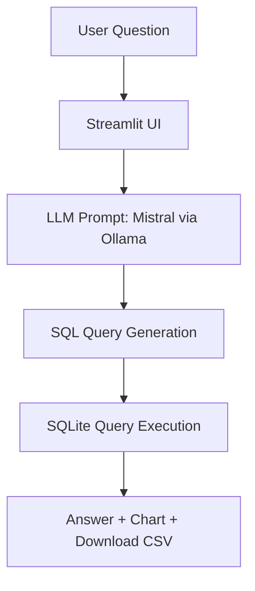

# 🔍 Data Whisperer: GenAI-Powered E-commerce SQL Assistant
 


> **Ask questions like a boss. Get SQL-powered answers instantly. All offline. All AI.**  

---

## 🧠 Project Overview

`Data Whisperer` is a local, private, and blazing-fast **AI Agent** that:
- Accepts natural language questions via a sleek web interface.
- Translates them into optimized **SQLite** queries using a local **LLM (Mistral)**.
- Fetches answers from e-commerce datasets and presents them beautifully — with **charts**, **tables**, and **downloadable results**.

> 🧪 Think of it like ChatGPT for your sales data — but self-hosted and private.

---

## 📊 Datasets Used

The project uses 3 datasets representing e-commerce metrics:

| Table Name      | Description                              |
|-----------------|------------------------------------------|
| `ad_sales`      | Ad clicks, impressions, spend, sales     |
| `total_sales`   | Overall sales and units ordered          |
| `eligibility`   | Eligibility status and messages for SKUs |

---

## 🏗️ Architecture



---

## ⚙️ Tech Stack

| Component     | Tech                                      |
|---------------|-------------------------------------------|
| 💬 Interface  | [Streamlit](https://streamlit.io)         |
| 🧠 LLM        | [Mistral via Ollama](https://ollama.com)  |
| 🛢️ Database   | [SQLite](https://sqlite.org)              |
| 📈 Charts     | Built-in Streamlit Visuals (`bar_chart`, `line_chart`, `pie_chart`) |
| 📦 Backend    | Python + Pandas + Requests                |

---

## 🚀 Features

✅ **Natural Language Interface**  
✅ **SQL Generation using LLM**  
✅ **Query Execution on Local DB**  
✅ **Schema Viewer** (Sidebar Explorer)  
✅ **Bar/Line/Pie Charts for 2-column results**  
✅ **CSV Export Buttons**  
✅ **Streaming Response from LLM**  
✅ **Sticky Header & Footer**  
✅ **Mobile-Responsive Layout**  
✅ **Fast as hell**  

---

## 📷 Screenshots

> 📍 Sample question: "What is my total sales?"


> 📍 Sidebar schema viewer


> 📍 Pie chart + CSV export


---

## 🔧 Setup Instructions

### 1. Clone the repo

```bash
git clone https://github.com/HarishSarav21/DataWhisperer.git
cd DataWhisperer
```

### 2. Load Data into Database

Before starting the app, you need to generate the `ecommerce.db` file from the provided CSVs:

```bash
python db_create.py
```

This will:
- Load your 3 datasets
- Create a `ecommerce.db` SQLite database
- Show a preview of sample rows
- Confirm all table names

### 3. Install dependencies

```bash
pip install -r requirements.txt
```

### 4. Place your datasets

Put your CSV files inside a folder named `DATASET/`:
- `Product-Level Ad Sales and Metrics (mapped).csv`
- `Product-Level Total Sales and Metrics (mapped).csv`
- `Product-Level Eligibility Table (mapped).csv`

### 5. Start your LLM (via Ollama)

```bash
ollama run mistral
```

Make sure Ollama is running at: `http://localhost:11434`

### 6. Run the app

```bash
streamlit run app.py
```

---

## 🧪 Sample Questions to Try

| 🔎 Question                            | 🧠 What's happening? |
|----------------------------------------|----------------------|
| What is my total sales?                | Summing `total_sales` |
| Calculate the RoAS                     | ad_sales / ad_spend |
| Which product had the highest CPC?     | ad_spend / clicks |
| Items with no eligibility message?     | `WHERE message IS NULL` |
| Show conversion rate per item          | units_sold / clicks |

---

## 📦 Folder Structure

```
├── app.py                 # Main Streamlit app
├── db_create.py           # Loads CSVs and creates SQLite DB
├── ecommerce.db           # Auto-generated DB file
├── DATASET/               # Your CSVs here
│   ├── Product-Level Ad Sales...
│   └── Product-Level Total Sales...
│   └── Product-Level Eligibility...
├── README.md
└── requirements.txt
```

---

## 📽️ Demo Video

> 🎥 [Link to Google Drive Demo Video](https://drive.google.com/file/d/1RGHWxX54pNa2Plpl23BffU96Um6HzRSS/view?usp=sharing)

---

> 🚀 _“Talk to your data like a pro. Whispered, not shouted.”_
